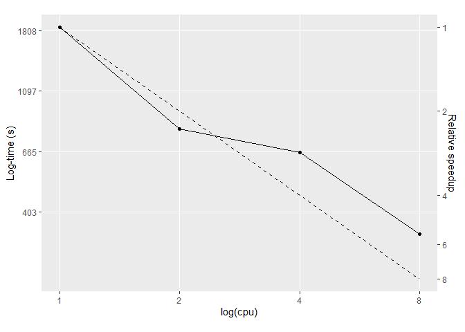

In the 2.23 update, Stan introduced `reduce_sum`, which allows us to
parallelise within-chain computation. The 1D case- where the response
variable is a vector- has a well worked example
([here](https://mc-stan.org/users/documentation/case-studies/reduce_sum_tutorial.html)),
and the speedups for these simple models where most of the computation
can be placed inside the parallel sum component are reasonably well
documented. It’s taken a bit of experimentation to figure out how to
apply `reduce_sum` to a 2D case and I’m not aware of equivalent worked
examples for these cases, or example speedups. This document therefore
aims to provide a minimal example of a 2D application of `reduce_sum`
and take a look at some of the speedups.

There is:

1.  A brief description of the model and the data structure
2.  Fitting this model using `reduce_sum`
3.  A comparison of speedups with increasing \#cores

They are referred to at various points throughout, but see also:

-   The `reduce_sum` documentation
    <https://mc-stan.org/docs/2_23/stan-users-guide/reduce-sum.html>

-   [The 1D worked example (logistic
    regression)](https://mc-stan.org/users/documentation/case-studies/reduce_sum_tutorial.html),
    which has details that aren’t included here.

-   <https://jsocolar.github.io/occupancyModels/> as an
    introduction/explanation to the model in Stan.

(Brief) model description
=========================

A model familiar to many ecologists is the occupancy model. They come in
a lot of flavours, but, very broadly, these models are typically
attempting to relate binary presence/absence to characteristics of the
environment and/or species, usually using data collected from a number
of different spatial locations.

Of these models a further broad subset are detection-occupancy models,
which attempt to delinate observed occupancy into separate detection and
occupancy components (i.e. acknowledge that the probability of observing
a given species depends both on the underlying probability of presence
and also how likely it is to be observed, given presence). In order to
do this, two things are required: first there needs to be some form of
replicated sampling, and second we need to be able to reasonably assume
that if a species is observed on a single one of these replicates, it is
‘present’ (in some sense) on every other of the replicates. The
resulting mixture of 0s and 1s then allow for us to say something about
both detection and occupancy.

We’ll take a look at these detection-occupancy models, partly because it
is working with these models that have motivated the need to
parallelise, due to the fact that these datasets can quickly become
large and they aren’t obviously reduced to a 1D observation vector for
modelling, but also they are also somewhat distinct from different
flavours of glm that are already documented.

These models are readily fit in Stan (note though that they are slightly
differently formulated than in JAGS/BUGS, see
[here](https://jsocolar.github.io/occupancyModels/)).

Data simulation
---------------

For our simulated species, there is variation in occupancy both across
species (i.e. some species are more common than others), and also across
an environmental gradient. Across all species, there is an average
tendency for occupancy probability to increase across the environmental
gradient, but there is variation in the strength of this association
across species, such that some species can decrease in occupancy
probability along this gradient. Detection varies across species, with
some species more readily detected than others, and also with a
visit-level covariate, which, for the sake of argument, we’ll call time
of day. Again, there is an average (negative) time of day effect across
species, but species also vary in the strength of this association.

More formally:

*ψ**i**k* = *β*0*k* + *β*1*k*.*x**i*

*θ**i**j**k* = *α*0*k* + *α*1*k*.*t**i**j*

*Z**i**k* ∼ *b**e**r**n**o**u**l**l**i*(*l**o**g**i**t* − 1(*ψ**i**k*))

*y**i**j**k* ∼ *b**e**r**n**o**u**l**l**i*(*l**o**g**i**t* − 1(*θ**i**j**k*) × *Z*)

where *ψ**i**k* is the occupancy probability, which varies
according to a species-level intercept, and a species-level
environmental association (where *x**i* is the environmental
variable). *θ**i**j**k* is the detection component, and
varies according to a species-level intercept, and a species-level time
of day effect. All species-level effects are simulated and modelled as
normally-distributed random effects, i.e. eight hyperparameters in
total.

Data are generated from this model in the following script:

    source("simulate_data.R")

For the timings, I’ll generate 50 species across 50 sites and 4 visits
(i.e. 10,000 observations in total).

Visually, the model look something like this (for nine example species):

Nine example species taken from the full simulation. Solid line
indicates the underlying occupancy relationship, while the dashed line
indicates the probability of detection, accounting for the species’
detectability. As this depends both on the species’ detectibility and
also a visit-level covariate (time of day), the detectibility is not a
constant offset, but rather varies depending on time of day (which
varies between 0 and 1). Note the variation in the environmental
association, the detection offset, and the strength of the time-of-day
effect on detection accross species

Data structure
--------------

Observations inherently have a 3D structure, structured by the point
that was surveyed (point *i*), the visit to the point (visit *j*), and
the species that was observed/unobserved (species *k*). However, these
are readily collapsed to a 2D structure by collapsing the species
dimension to produce a dataframe that has dimensions
(*n**p**o**i**n**t**s* × *n**s**p**e**c**i**e**s*,
*n**v**i**s**i**t**s*), with each row now indexing a
point:species combination.

    head(det_sim_wide)

      i k 1 2 3 4
    1 1 1 1 0 0 1
    2 1 2 0 0 0 0
    3 1 3 0 0 0 0
    4 1 4 0 0 0 0
    5 1 5 1 0 0 0
    6 1 6 1 0 0 0

We have two columns that identify the species:point combination,
followed by 4 columns that give the observation (0 or 1) across each of
4 visits to the point.

The time of day predictor has the same dimensions. It could be reduced
to a smaller \[i, j\] array, as time of day only depends upon when the
point was visited, not upon which species were observed, but it’s more
straightforward to just produce it as a array of times with the same
dimensions as the detection data.

    head(time_sim_wide)

      i k          1          2          3         4
    1 1 1 0.94783188 0.78105551 0.46989183 0.4422911
    2 1 2 0.88034349 0.61913381 0.46815666 0.3397781
    3 1 3 0.72850613 0.56020302 0.05316815 0.5970649
    4 1 4 0.48861836 0.08418942 0.34289308 0.9469285
    5 1 5 0.70473823 0.28931803 0.93520186 0.1886958
    6 1 6 0.05258743 0.68159763 0.56526425 0.1574177

    head(env_var)

    [1]  1.330710246 -1.219108032  1.474787030 -1.996569258 -0.008873639
    [6]  1.070783332

Finally, an environmental variable, that just varies between points.

The Stan model
==============

The Stan file is a little complicated if it’s not a model you are
already familiar with. The main oddity is the if-statement asking if
Q==1: this just refers to the central assumption mentioned at the
outset, where points that have at least one observation are treated as
though the species is present (but undetected) at all other visits. The
converse, where a species is never observed at a point is more
complicated, because now we have to acknowledge that it might have been
there all along, but never observed, and also that it might simply not
be there. Again <https://jsocolar.github.io/occupancyModels/> explains
this in more detail.

    data {
        int<lower=1> n_tot;
        int<lower=1> n_visit;
        int<lower=1> n_species;
        int<lower=1> n_point;
        
        int<lower=1> id_sp[n_tot];
        int<lower=1> id_pt[n_tot];
        int det[n_tot, n_visit];
        row_vector[n_visit] vis_cov[n_tot];
        vector[n_tot] Q;
        vector[n_point] env_var;
        
    }
    parameters {
        // psi: occupancy 
        real mu_b0;
        real<lower=0> sigma_b0;
        vector[n_species] b0_raw;
        
        real mu_b1;
        real<lower=0> sigma_b1;
        vector[n_species] b1_raw;
        
        // theta: detection
        real mu_d0; 
        real<lower=0> sigma_d0;
        vector[n_species] d0_raw;
        
        real mu_d1; 
        real<lower=0> sigma_d1;
        vector[n_species] d1_raw;
        
    }
    transformed parameters{
        // scaling
        vector[n_species] b0 = mu_b0 + b0_raw * sigma_b0;
        vector[n_species] b1 = mu_b1 + b1_raw * sigma_b1;
        vector[n_species] d0 = mu_d0 + d0_raw * sigma_d0;
        vector[n_species] d1 = mu_d1 + d1_raw * sigma_d1;
    }
    model {
        vector[n_tot] lp;
        real logit_psi;
        row_vector[n_visit] logit_theta;
        
        for (i in 1:n_tot){
            logit_psi = b0[id_sp[i]] + b1[id_sp[i]] * env_var[id_pt[i]];
            logit_theta = d0[id_sp[i]] + d1[id_sp[i]] * vis_cov[i];
            
            if (Q[i] == 1) 
                lp[i] = log_inv_logit(logit_psi) +
                    bernoulli_logit_lpmf(det[i] | logit_theta[i]);
            else lp[i] = log_sum_exp(
                log_inv_logit(logit_psi) +
                    log1m_inv_logit(logit_theta[1]) +
                    log1m_inv_logit(logit_theta[2]) +
                    log1m_inv_logit(logit_theta[3]) +
                    log1m_inv_logit(logit_theta[4]),
                log1m_inv_logit(logit_psi));
        }
        
        target += sum(lp);
        
        // Priors
        //...
    }

`reduce_sum` formulation
========================

To get the parallelisation done, we need to break up the computation
such that it can be passed out to multiple workers. To do this, the
model itself wrapped in `partial_sum` (user-written function), which
will allow the full task of calculating all the log-probabilities to be
broken up into chunks (the size of which are set by the grainsize
argument). `reduce_sum` will automate the choice about how to chunk up
the data, and pass these data chunks out to be computed in parallel.

    functions{
        real partial_sum(int[,] det_slice, 
                         int start, int end, 
                         int n_visit, 
                         vector b0, 
                         vector b1, 
                         vector d0, 
                         vector d1, 
                         vector env_var, 
                         row_vector[] vis_cov, 
                         int[] id_sp, 
                         int[] id_pt, 
                         int[] Q) {
            // indexing
            int len = end - start + 1;
            int r0 = start - 1;
            
            vector[len] lp;
            real logit_psi;
            row_vector[n_visit] logit_theta;
            
            for (r in 1:len){
                logit_psi = b0[id_sp[r0+r]] + b1[id_sp[r0+r]] * env_var[id_pt[r0+r]];
                logit_theta = d0[id_sp[r0+r]] + d1[id_sp[r0+r]] * vis_cov[r0+r];
                if (Q[r0+r] == 1) 
                    lp[r] = log_inv_logit(logit_psi) +
                        bernoulli_logit_lpmf(det_slice[r] | logit_theta);
                else lp[r] = log_sum_exp(
                    log_inv_logit(logit_psi) +
                        log1m_inv_logit(logit_theta[1]) +
                        log1m_inv_logit(logit_theta[2]) +
                        log1m_inv_logit(logit_theta[3]) +
                        log1m_inv_logit(logit_theta[4]),
                    log1m_inv_logit(logit_psi));
            }
            return sum(lp);
        }
    }
    data {
        int<lower=1> n_tot;
        int<lower=1> n_visit;
        int<lower=1> n_species;
        int<lower=1> n_point;
        
        int<lower=1> id_sp[n_tot];
        int<lower=1> id_pt[n_tot];
        int det[n_tot, n_visit];
        row_vector[n_visit] vis_cov[n_tot];
        int Q[n_tot];
        vector[n_point] env_var;
        int<lower=1> grainsize;
    }
    parameters {
        // psi: occupancy 
        real mu_b0;
        real<lower=0> sigma_b0;
        vector[n_species] b0_raw;
        
        real mu_b1;
        real<lower=0> sigma_b1;
        vector[n_species] b1_raw;
        
        // theta: detection
        real mu_d0; 
        real<lower=0> sigma_d0;
        vector[n_species] d0_raw;
        
        real mu_d1; 
        real<lower=0> sigma_d1;
        vector[n_species] d1_raw;
        
    }
    transformed parameters{
        // scaling
        vector[n_species] b0 = mu_b0 + b0_raw * sigma_b0;
        vector[n_species] b1 = mu_b1 + b1_raw * sigma_b1;
        vector[n_species] d0 = mu_d0 + d0_raw * sigma_d0;
        vector[n_species] d1 = mu_d1 + d1_raw * sigma_d1;
    }
    model {
        target += reduce_sum_static(partial_sum, det, grainsize, n_visit, b0, b1, d0, 
                                    d1, env_var, vis_cov, id_sp, id_pt, Q);
                                    
        // priors
        mu_b0 ~ normal(0, 10);
        mu_b1 ~ normal(0, 10);
        mu_d0 ~ normal(0, 10);
        mu_d1 ~ normal(0, 10);
        
        sigma_b0 ~ normal(0, 10);
        sigma_b1 ~ normal(0, 10);
        sigma_d0 ~ normal(0, 10);
        sigma_d1 ~ normal(0, 10);
        
        b0_raw ~ normal(0,1);
        b1_raw ~ normal(0,1);
        d0_raw ~ normal(0,1);
        d1_raw ~ normal(0,1);
        
        
    }

This is largely a repetition of the previous stan model, the only
difference is that the model has been shifted into the `parallel_sum`
function block. Note that a lot of stuff has to get passed to this
function: you could simplify it by doing more computation outside
(e.g. transforming some parameters) and passing a reduced set of
objects, but then you would be shifting more of the computation
*outside* of the bit that will be run in parallel. As the
parallelisation speedup would take a hit from doing this, it’s better to
do it this way, despite the unwieldiness of the ensuing function.

Timings
=======

Timings across 1, 2, 4, and 8 cores, using a simulated dataset with 50
species, 50 sites, and 4 visits (i.e. 10,000 observations in total).

Timings:

      cpu   time speedup
    1   1 1860.0    1.00
    2   2  801.7    2.32
    3   4  660.1    2.82
    4   8  337.7    5.51

As you would hope, we are getting good speedups by parallelising the
model. While the dataset simulated here is fairly small, with a larger
dataset, a 4-6x speedup on a chain that would otherwise take &gt;1 week
to run is not trivial at all! The speedup itself will also depend on the
proportion of the model that can be placed within the `partial_sum`
function (see
[here](https://statmodeling.stat.columbia.edu/2020/05/05/easy-within-chain-parallelisation-in-stan/)).
With increased model complexity, as long as the relative proportions of
‘stuff in the `partial_sum`’ to ‘stuff outside the `partial_sum`’ remain
constant, we should expect to see similar speedups. Anecdotally this
seems to be the case, and I’ve seen fairly equivalent speedups running
these models with more complexity (e.g. more terms in the detection and
occupancy components).

For models where almost all the computation can be placed inside the
`partial_sum`, we can achieve a 1:1 speedup (in some cases, marginally
better!). Given that this model has a bunch of centering of
hyper-parameters outside of the main model block, it is to be expected
that we should see speedups slightly below this line.

The other thing to mention is that when comparing speedups, it’s
important to give the computer a proper job to really see the speedup
from parallelisation. If it only takes 30 seconds to run the model, then
the speedups are all over the place (though the tendency to get faster
with increasing cores is present). Initially I had been simulating 15
species at 15 sites, across 4 visits (i.e. 900 observations)- speedups
were (a) not very repeatable, varying substantially between runs, and
(b) the scaling didn’t look great. Presumably this largely arises
because the overhead paid for parallelising makes up a greater
proportion of the total run time, and it’s difficult to get large
speed-gains on the bit that is being run in parallel.
