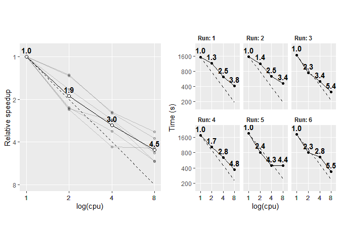

Reduce\_sum applied to 2D data
================
22 June 2020

In the 2.23 update, Stan introduced `reduce_sum`, which allows us to
parallelise within-chain computation. The 1D case- where the response
variable is a vector- has a well worked example
([here](https://mc-stan.org/users/documentation/case-studies/reduce_sum_tutorial.html)),
and the speedups for these simple models where most of the computation
can be placed inside the parallel sum component are reasonably well
documented. It’s taken a bit of experimentation to figure out how to
apply `reduce_sum` to a 2D case and I’m not aware of equivalent worked
examples for these cases, or example speedups. This document therefore
aims to provide a minimal example of a 2D application of `reduce_sum`
and take a look at some of the speedups.

There is:

1.  A brief description of the model and the data structure
2.  Fitting this model using `reduce_sum`
3.  A comparison of speedups with increasing number of threads

They are referred to at various points throughout, but see also:

  - The `reduce_sum` documentation:
    <https://mc-stan.org/docs/2_23/stan-users-guide/reduce-sum.html>

  - [The 1D worked example (logistic
    regression)](https://mc-stan.org/users/documentation/case-studies/reduce_sum_tutorial.html),
    which has details that aren’t included here

  - <https://jsocolar.github.io/marginalizedOccupancy/> as an
    introduction/explanation to the model in Stan

# 1\. (Brief) model description

A model familiar to many ecologists is the occupancy model. They come in
a lot of flavours, but, very broadly, these models are typically
attempting to relate binary presence/absence to characteristics of the
environment and/or species, usually using data collected from a number
of different spatial locations.

Of these models a further broad subset are detection-occupancy models,
which attempt to delinate observed occupancy into separate detection and
occupancy components (i.e. acknowledge that the probability of observing
a given species depends both on the underlying probability of presence
and also how likely it is to be observed, given presence). In order to
do this, two things are required: first there needs to be some form of
replicated sampling, and second we need to be able to reasonably assume
that if a species is observed on a single one of these replicates, it is
‘present’ (in some sense) on every other of the replicates. The
resulting mixture of 0s and 1s then allow for us to say something about
both detection and occupancy.

We’ll take a look at these detection-occupancy models, partly because it
is working with these models that have motivated the need to
parallelise, due to the fact that these datasets can quickly become
large and they aren’t obviously reduced to a 1D observation vector for
modelling, but also they are also somewhat distinct from different
flavours of glm that are already documented.

These models are readily fit in Stan (note though that they are slightly
differently formulated than in JAGS/BUGS, see
[here](https://jsocolar.github.io/marginalizedOccupancy/)).

## Data simulation

For our simulated species, there is variation in occupancy both across
species (i.e. some species are more common than others), and also across
an environmental gradient. Across all species, there is an average
tendency for occupancy probability to increase across the environmental
gradient, but there is variation in the strength of this association
across species, such that some species can decrease in occupancy
probability along this gradient. Detection varies across species, with
some species more readily detected than others, and also with a
visit-level covariate, which, for the sake of argument, we’ll call time
of day. Again, there is an average (negative) time of day effect across
species, but species also vary in the strength of this association.

More formally:

  
  

  
  

  
)")  

  
 \\times Z)")  

where  indexes points,
 indexes visits,
 indexes species.
 is the occupancy probability, which varies according to a
species-level intercept, and a species-level environmental association
(where  is the
environmental variable).
 is the detection component, and varies according to a
species-level intercept, and a species-level time of day effect. All
species-level effects are simulated and modelled as normally-distributed
random effects, i.e. eight hyperparameters in total.

Data are generated from this model in the following script:

``` r
source("simulate_data.R")
```

For the timings, I’ll generate 50 species across 50 sites and 4 visits
(i.e. 10,000 observations in total).

Visually, the model look something like this (for nine example
species):

<div class="figure" style="text-align: center">


<p class="caption">

**Figure 1:** Nine example species taken from the full simulation. Solid
line indicates the underlying occupancy relationship, while the dashed
line indicates the probability of detecting a given species on a point,
estimated using the upper and lower bounds on the detection effect (at
time=0 and time=1 respectively), and accounting for the species’ overall
detectability. Note the variation across species in the environmental
association, the detection offset, and the strength of the time-of-day
effect.

</p>

</div>

## Data structure

Observations inherently have a 3D structure, structured by the point
that was surveyed (point ), the visit to the point (visit
), and the species that
was observed/unobserved (species
). However, these are
readily collapsed to a 2D structure by collapsing the species dimension
to produce a dataframe that has dimensions (,
), with each row now indexing a point:species combination.

``` r
head(det_sim_wide)
```

``` 
  i k 1 2 3 4
1 1 1 0 0 1 1
2 1 2 0 1 0 0
3 1 3 0 0 0 0
4 1 4 0 1 0 0
5 1 5 0 0 0 0
6 1 6 0 0 0 0
```

We have two columns that identify the species:point combination,
followed by 4 columns that give the observation (0 or 1) across each of
4 visits to the point.

The time of day predictor has the same dimensions. It could be reduced
to a smaller \[i, j\] array, as time of day only depends upon when the
point was visited, not upon which species were observed, but it’s more
straightforward to just produce it as a array of times with the same
dimensions as the detection data.

``` r
head(time_sim_wide)
```

``` 
  i k         1         2         3         4
1 1 1 0.5050863 0.1626824 0.2887219 0.2981168
2 1 2 0.3444656 0.6588384 0.2195502 0.8472350
3 1 3 0.6711429 0.6799846 0.8495923 0.6179082
4 1 4 0.2644159 0.1686149 0.1075390 0.2057810
5 1 5 0.3336012 0.5206097 0.8926069 0.9725047
6 1 6 0.2652108 0.8541405 0.2386593 0.5799014
```

``` r
head(env_var)
```

    [1] -0.26199577 -0.06884403 -0.37888356  2.58195893  0.12983414 -0.71302498

Finally, an environmental variable, that just varies between points.

# 2\. The Stan model

The Stan file is a little complicated if it’s not a model you are
already familiar with. The main oddity is the if-statement asking if
Q==1: this just refers to the central assumption mentioned at the
outset, where points that have at least one observation are treated as
though the species is present (but undetected) at all other visits. The
converse, where a species is never observed at a point is more
complicated, because now we have to acknowledge that it might have been
there all along, but never observed, and also that it might simply not
be there. Again <https://jsocolar.github.io/marginalizedOccupancy/> explains
this in more detail.

    data {
        int<lower=1> n_tot; // total number of rows in df
        int<lower=1> n_visit; // width of df (number of visits)
        int<lower=1> n_species;
        int<lower=1> n_point; // number of points sampled at
        
        int<lower=1> id_sp[n_tot]; //an index (length n_tot) for species identity
        int<lower=1> id_pt[n_tot]; //an index (length n_tot) for point identity
        int det[n_tot, n_visit]; //an index (length n_tot) for point identity
        row_vector[n_visit] vis_cov[n_tot]; // visit covariate (time of day)
        vector[n_tot] Q; // indexes whether a species has been observed at the point
        vector[n_point] env_var;
        
    }
    parameters {
        // occupancy intercept-by-species
        real mu_b0;
        real<lower=0> sigma_b0;
        vector[n_species] b0_raw;
        // occupancy slope-by-species
        real mu_b1;
        real<lower=0> sigma_b1;
        vector[n_species] b1_raw;
        
        // detection intercept-by-species
        real mu_d0; 
        real<lower=0> sigma_d0;
        vector[n_species] d0_raw;
        // detection slope-by-species
        real mu_d1; 
        real<lower=0> sigma_d1;
        vector[n_species] d1_raw;
        
    }
    transformed parameters{
        // sorting out non-centering
        vector[n_species] b0 = mu_b0 + b0_raw * sigma_b0;
        vector[n_species] b1 = mu_b1 + b1_raw * sigma_b1;
        vector[n_species] d0 = mu_d0 + d0_raw * sigma_d0;
        vector[n_species] d1 = mu_d1 + d1_raw * sigma_d1;
    }
    model {
        vector[n_tot] lp;
        real logit_psi;
        row_vector[n_visit] logit_theta;
        
        for (i in 1:n_tot){
            logit_psi = b0[id_sp[i]] + b1[id_sp[i]] * env_var[id_pt[i]];
            logit_theta = d0[id_sp[i]] + d1[id_sp[i]] * vis_cov[i];
            
            if (Q[i] == 1) 
                lp[i] = log_inv_logit(logit_psi) +
                    bernoulli_logit_lpmf(det[i] | logit_theta[i]);
            else lp[i] = log_sum_exp(
                log_inv_logit(logit_psi) +
                    log1m_inv_logit(logit_theta[1]) +
                    log1m_inv_logit(logit_theta[2]) +
                    log1m_inv_logit(logit_theta[3]) +
                    log1m_inv_logit(logit_theta[4]),
                log1m_inv_logit(logit_psi));
        }
        
        target += sum(lp);
        
        // priors
        mu_b0 ~ normal(0, 10);
        mu_b1 ~ normal(0, 10);
        mu_d0 ~ normal(0, 10);
        mu_d1 ~ normal(0, 10);
        
        sigma_b0 ~ normal(0, 10);
        sigma_b1 ~ normal(0, 10);
        sigma_d0 ~ normal(0, 10);
        sigma_d1 ~ normal(0, 10);
        
        b0_raw ~ normal(0,1);
        b1_raw ~ normal(0,1);
        d0_raw ~ normal(0,1);
        d1_raw ~ normal(0,1);
    }

## `reduce_sum` formulation

To get the parallelisation done, we need to break up the computation
such that it can be passed out to multiple workers. To do this, the
model itself wrapped in `partial_sum` (user-written function), which
will allow the full task of calculating all the log-probabilities to be
broken up into chunks (the size of which are set by the grainsize
argument). `reduce_sum` will automate the choice about how to chunk up
the data, and pass these data chunks out to be computed in parallel.

    functions{
        real partial_sum(int[,] det_slice, 
                         int start, int end, 
                         int n_visit, 
                         vector b0, 
                         vector b1, 
                         vector d0, 
                         vector d1, 
                         vector env_var, 
                         row_vector[] vis_cov, 
                         int[] id_sp, 
                         int[] id_pt, 
                         int[] Q) {
            // indexing
            int len = end - start + 1;
            int r0 = start - 1;
            
            vector[len] lp;
            real logit_psi;
            row_vector[n_visit] logit_theta;
            
            for (r in 1:len){
                logit_psi = b0[id_sp[r0+r]] + b1[id_sp[r0+r]] * env_var[id_pt[r0+r]];
                logit_theta = d0[id_sp[r0+r]] + d1[id_sp[r0+r]] * vis_cov[r0+r];
                if (Q[r0+r] == 1) 
                    lp[r] = log_inv_logit(logit_psi) +
                        bernoulli_logit_lpmf(det_slice[r] | logit_theta);
                else lp[r] = log_sum_exp(
                    log_inv_logit(logit_psi) +
                        log1m_inv_logit(logit_theta[1]) +
                        log1m_inv_logit(logit_theta[2]) +
                        log1m_inv_logit(logit_theta[3]) +
                        log1m_inv_logit(logit_theta[4]),
                    log1m_inv_logit(logit_psi));
            }
            return sum(lp);
        }
    }
    data {
        int<lower=1> n_tot; // total number of rows in df
        int<lower=1> n_visit; // width of df (number of visits)
        int<lower=1> n_species; 
        int<lower=1> n_point; // number of points sampled at
        
        int<lower=1> id_sp[n_tot]; //an index (length n_tot) for species identity
        int<lower=1> id_pt[n_tot]; //an index (length n_tot) for point identity
        int det[n_tot, n_visit]; // the detection matrix
        row_vector[n_visit] vis_cov[n_tot]; // visit covariate (time of day)
        int Q[n_tot]; // indexes whether a species has been observed at the point
        vector[n_point] env_var; 
        int<lower=1> grainsize; 
    }
    parameters {
        // occupancy intercept-by-species
        real mu_b0;
        real<lower=0> sigma_b0;
        vector[n_species] b0_raw;
        // occupancy slope-by-species
        real mu_b1;
        real<lower=0> sigma_b1;
        vector[n_species] b1_raw;
        
        // detection intercept-by-species
        real mu_d0; 
        real<lower=0> sigma_d0;
        vector[n_species] d0_raw;
        // detection slope-by-species
        real mu_d1; 
        real<lower=0> sigma_d1;
        vector[n_species] d1_raw;
        
    }
    transformed parameters{
        // sorting out non-centering
        vector[n_species] b0 = mu_b0 + b0_raw * sigma_b0;
        vector[n_species] b1 = mu_b1 + b1_raw * sigma_b1;
        vector[n_species] d0 = mu_d0 + d0_raw * sigma_d0;
        vector[n_species] d1 = mu_d1 + d1_raw * sigma_d1;
    }
    model {
        target += reduce_sum_static(partial_sum, det, grainsize, n_visit, b0, b1, d0, 
                                    d1, env_var, vis_cov, id_sp, id_pt, Q);
                                    
        // priors
        mu_b0 ~ normal(0, 10);
        mu_b1 ~ normal(0, 10);
        mu_d0 ~ normal(0, 10);
        mu_d1 ~ normal(0, 10);
        
        sigma_b0 ~ normal(0, 10);
        sigma_b1 ~ normal(0, 10);
        sigma_d0 ~ normal(0, 10);
        sigma_d1 ~ normal(0, 10);
        
        b0_raw ~ normal(0,1);
        b1_raw ~ normal(0,1);
        d0_raw ~ normal(0,1);
        d1_raw ~ normal(0,1);
    }

This is largely a repetition of the previous stan model, the only
difference is that the model has been shifted into the `parallel_sum`
function block. Note that a lot of stuff has to get passed to this
function: you could simplify it by doing more computation outside
(e.g. transforming some parameters) and passing a reduced set of
objects, but then you would be shifting more of the computation
*outside* of the bit that will be run in parallel. As the
parallelisation speedup would take a hit from doing this, it’s better to
do it this way, despite the unwieldiness of the ensuing function.

## Running the multi-threaded model

When compiling the model, we need to specify that it is threaded
(cpp\_options), and then specify the threads\_per\_chain at the sampling
step. The model is run with `cmdstanr` (at some point I presume
multi-threading will be rolled out to `rstan` as well).

``` r
library(cmdstanr)
# data
stan_data <- list(n_tot = nrow(det_sim_wide), 
                  n_visit = 4, 
                  n_species = length(unique(det_sim_wide$k)), 
                  n_point = length(unique(det_sim_wide$i)), 
                  id_sp = det_sim_wide$k, 
                  id_pt = det_sim_wide$i, 
                  det = det_sim_wide[,3:6],
                  vis_cov = time_sim_wide[,3:6],
                  Q = rowSums(det_sim_wide[,3:6]), 
                  env_var = env_var, 
                  grainsize = 1)


## Run mod ----
library(cmdstanr)
mod <- cmdstan_model("occupancy_example_redsum.stan", 
                     cpp_options = list(stan_threads = T))

samps <- mod$sample(data = stan_data, 
                    chains = 1, 
                    threads_per_chain = 8, 
                    iter_warmup = 1000, 
                    iter_sampling = 1000)
print(samps$time())
```

# 3\. Timings

    ## Warning in bind_rows_(x, .id): binding character and factor vector, coercing
    ## into character vector

<div class="figure" style="text-align: center">



<p class="caption">

**Figure 2:** Timings across 1, 2, 4, and 8 cores, using a simulated
dataset with 50 species, 50 sites, and 4 visits (i.e. 10,000
observations in total). Model fitting was repeated 6 times each (in
sequence of 8, 4, 2, 1 threads, repeated 6 times). Left hand panel
presents the average speedup across runs, while the right hand panel
presents each individual run, with Time on the y-axis. Speedup figure
given above the points (average in the left-hand panel).

</p>

</div>

As you would hope, we are getting good average speedups by parallelising
the model. While the dataset simulated here is fairly small, with a
larger dataset, a 4.5x speedup on a chain that would otherwise take \>1
week to run is not trivial at all\! The speedup depends on the
proportion of the model that can be placed within the `partial_sum`
function (see
[here](https://statmodeling.stat.columbia.edu/2020/05/05/easy-within-chain-parallelisation-in-stan/)).
With increased model complexity, as long as the relative proportions of
‘stuff in the `partial_sum`’ to ‘stuff outside the `partial_sum`’
remain constant, we should expect to see similar speedups. Anecdotally
this seems to be the case, and I’ve seen fairly equivalent speedups
running these models with more complexity (e.g. more terms in the
detection and occupancy components).

For models where almost all the computation can be placed inside the
`partial_sum`, we can achieve a 1:1 speedup (in some cases, marginally
better\!). Given that this model has a bunch of centering of
hyper-parameters outside of the main model block, it is to be expected
that we should see speedups slightly below this line. Some individual
runs substantially exceeded the 1:1 line, which presumably arises due to
a very slow 1-thread run (with the speedup then being calculated
relative to this).

The other thing to mention is that when comparing speedups, it’s
important to give the computer a proper job to really see the speedup
from parallelisation. If it only takes 30 seconds to run the model, then
the speedups are all over the place (though the tendency to get faster
with increasing cores is present). Initially I had been simulating 15
species at 15 sites, across 4 visits (i.e. 900 observations)- speedups
were (a) not very repeatable, varying substantially between runs, and
(b) the scaling didn’t look great. Presumably this largely arises
because the overhead paid for parallelising makes up a greater
proportion of the total run time, and it’s difficult to get large
speed-gains on the bit that is being run in parallel.

## When to parallelise?

Ultimately, we care about the number of effective samples per unit time.
With extra cores available, we would also increase this just by running
extra chains simultaneously. In this case the warmup overhead would be
paid an extra time for each additional chain, unlike in the
multi-threaded version, where it is just being paid for the original
number of chains (assuming you put all your cores into increased threads
rather than chains). The obvious question is: what speedup would you
need to see to make running multiple threads better than running
multiple chains?

As a rough heuristic, we can do the following calculation. In the first
place we need to run multiple chains as the baseline comparison, as we
ideally need multiple chains to check convergence diagnostics, so I
would always run 4 chains in the first place, irrespective of how many
cores are available. The question then becomes, with more cores- beyond
those used by the 4 parallel chains in the first place- how should they
be allocated (to threads or cores)?. A back of the envelope calculation
would be that the number of post-warmup samples obtained,
, in a fixed unit of time is:

  
 \\times n_{core}")  
where  is the total number of samples, modified by
, the rate at which
samples are obtained,
 is
the number of warmup samples, and
 is the number of cores. Faster sampling due to more threads,
i.e. , will result in more total samples, while the warmup overhead
remains the same.

The difference in number of samples, as either rate or number of cores
is modified is therefore:   
 \\times c_{diff}")  
where both r and c are proportional increases (i.e. 4 to 8 cores would
be , and a rate doubling would be
). I’ve also rewritten the warmup as a proportion of the
total number of samples. From this we can see that the answer will
depend upon the speedup,
, and the proportion of samples spent on warmup. If we assume
you spend half of the total samples on warmup (i.e.
 is
half ), then as long as the speedup is \>1.5, increasing the number
of threads over the number of cores is best. If the warmup is less than
half the total samples, this speedup ‘break-even-point’ will increase,
as increasing the number of chains is penalised less by the warmup
overhead.

Multi-threading will also get diminishing returns, as the parallelisable
portion of the model becomes sliced ever more ways. Thus
 isn’t constant, but at some point will start to plateau with
increasing threads. So if the model is already on a bunch of threads,
then it may become worth running additional chains rather than
increasing the number of threads further.

Importantly, this is just a vague heuristic, and there are likely
subtleties in the relative speed of sampling. During warmup the HMC is
also adapting, which presumably means rate of sampling is slower, which
would adjust this relationship further in favour of running multiple
threads. This caveat aside, running this model on a dataset of this size
appears to come out in favour of multi-threading up to about 4-threads,
and approximately break-even at around 8-threads. Beyond this, to get
more samples in a fixed time it would be best to add chains.
